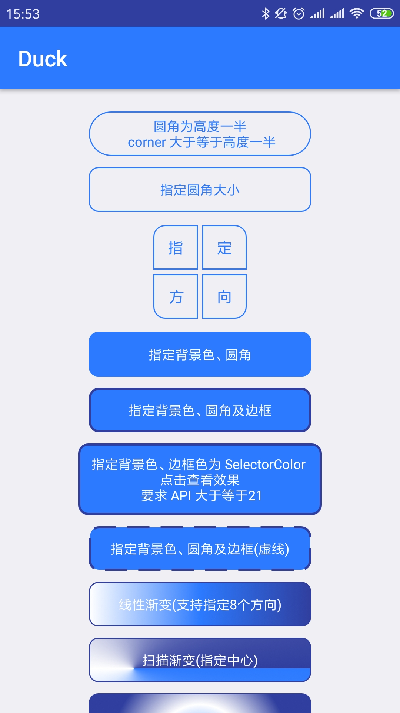
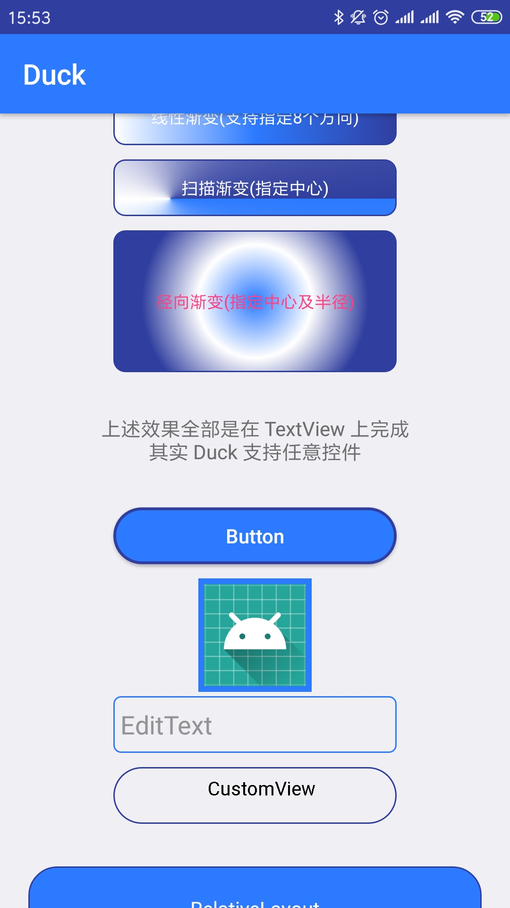
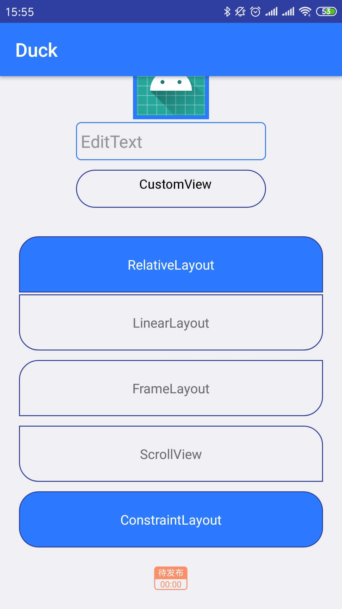

### Duck 文档
Duck 能帮助开发者直接在 xml 的任意控件上实现 shape 效果，而无需创建额外的文件，并且没有任何侵入性。







<br>

#### 使用

1.在项目的 build.gradle 文件下添加插件依赖

```gr
buildscript {
    ...    
    dependencies {
    	...
        classpath 'com.hujiang.aspectjx:gradle-android-plugin-aspectjx:2.0.2'
    }
}
```

2.在模块的 build.gradle 文件下添加

```groovy
api 'com.deemons.duck:duck:0.0.2'
```

<br>

#### 原理

得益于 AspectJ 的 AOP（面向切面编程）能力，我们可以在编译时期，直接在 View 及其子类的构造方法中插入相关代码，解析xml 中自定义的属性，最后设置到控件上。

由于 AspectJ 能遍历项目中所有依赖包，因此，无论是 support 库，还是第三方库都能得到很好支持。

但是 AOP 也存在一定问题，我们的 apk 中是不会存在系统原生 Android SDK 的，例如 `TextView` 这个系统控件，在编译时是不会打包到 apk 中，因此，AOP 技术对这种原生控件无能为力。

幸好，我们绝大部分项目为了兼容性，一般都会直接依赖官方的兼容库，即 `support` 相关的库。

在 support· 库中，会将一些原生控件，直接替换成 support 相关控件。

```java
android/support/v7/app/AppCompatViewInflater

switch (name) {
            case "TextView":
                view = createTextView(context, attrs);
                verifyNotNull(view, name);
                break;
            case "ImageView":
                view = createImageView(context, attrs);
                verifyNotNull(view, name);
                break;
            case "Button":
                view = createButton(context, attrs);
                verifyNotNull(view, name);
                break;
            case "EditText":
                view = createEditText(context, attrs);
                verifyNotNull(view, name);
                break;
   			......
        }
```

而对于这些控件，我们的 AOP 就能够生效了。

在 support 库中，没有替换掉 ViewGroup 的几个常用子类，如`LinearLayout` 、`RelativeLayout`、`FrameLayout`等，

所以，我们我们仿照 support 的替换方式，直接在 `LayoutInflater.Factory.onCreateView` 方法中注入相应的替换代码。

这个库的代码其实很少，我这里也只是实现了 Shape 这一个功能。AOP 还有很多事情可以做。